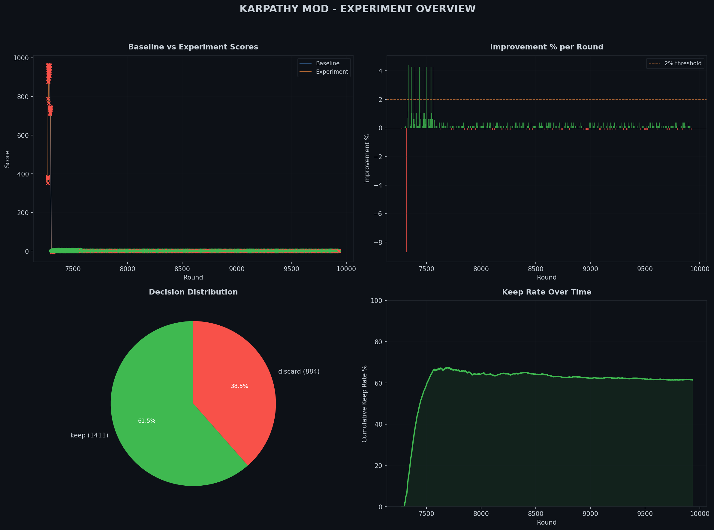
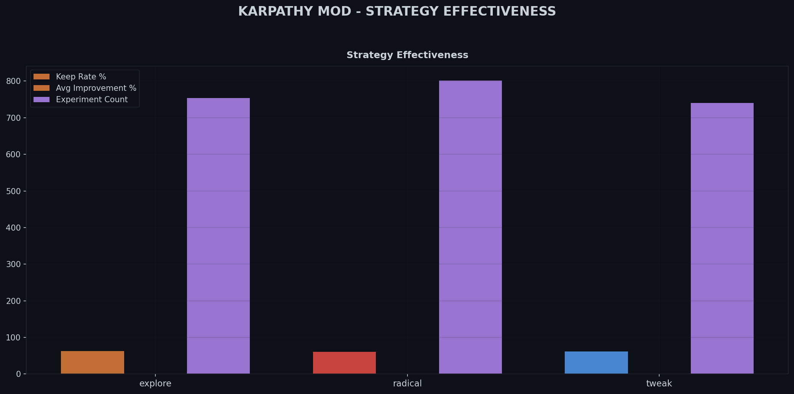
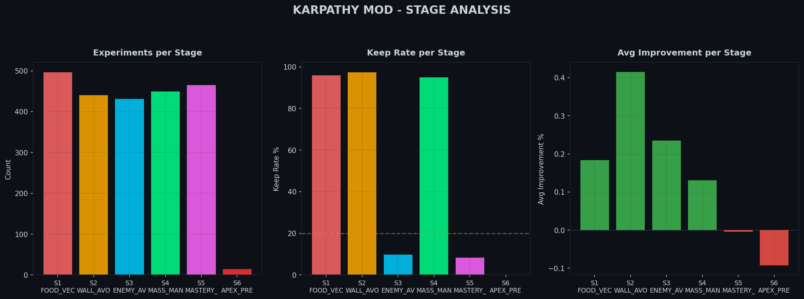
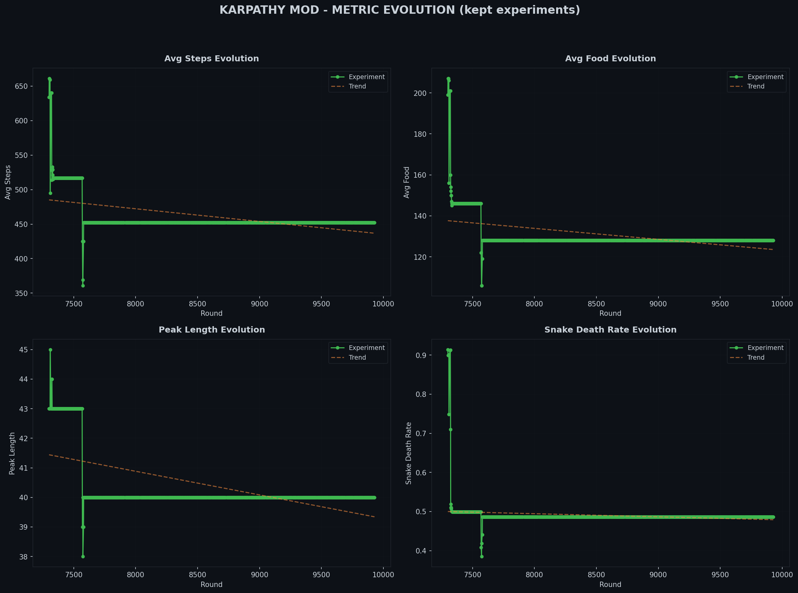
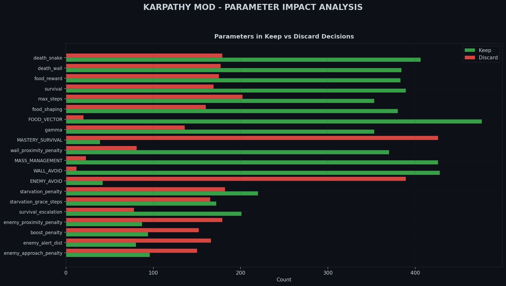
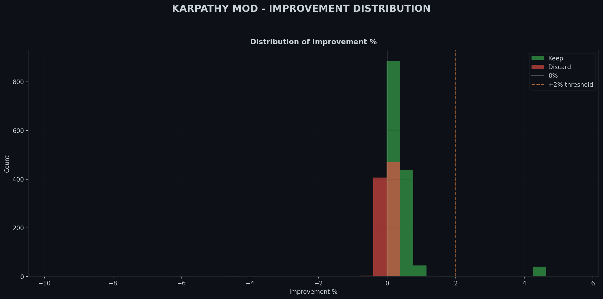
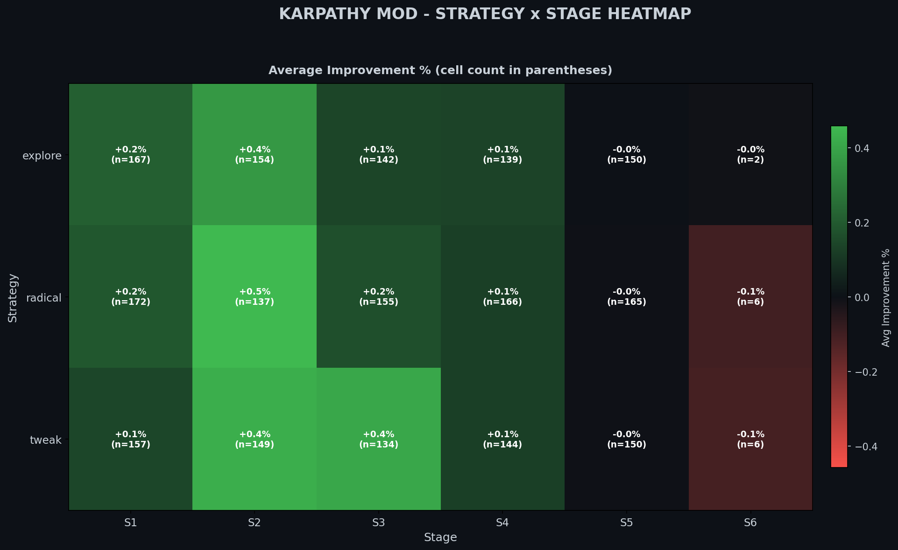

# Karpathy Mod Experiment Report
*Generated: 2026-04-09 05:54:01*

## Summary

| Metric | Value |
|--------|-------|
| Total experiments | 2295 |
| Keep rate | 61.5% |
| Kept | 1411 |
| Discarded | 884 |
| Inconclusive | 0 |
| Best improvement | +4.41% |
| Worst regression | -8.72% |
| Avg improvement | +0.19% |
| Trend | **REGRESSING** |

## Strategy Effectiveness

| Strategy | Count | Kept | Keep Rate | Avg Improvement | Best |
|----------|------:|-----:|----------:|----------------:|-----:|
| explore | 754 | 471 | 62.5% | +0.17% | +4.28% |
| tweak | 740 | 456 | 61.6% | +0.21% | +4.41% |
| radical | 801 | 484 | 60.4% | +0.18% | +4.28% |

## Stage Performance

| Stage | Name | Count | Kept | Keep Rate | Avg Improvement |
|------:|------|------:|-----:|----------:|----------------:|
| S1 | FOOD_VECTOR | 496 | 476 | 96.0% | +0.18% |
| S2 | WALL_AVOID | 440 | 428 | 97.3% | +0.41% |
| S3 | ENEMY_AVOID | 431 | 42 | 9.7% | +0.23% |
| S4 | MASS_MANAGEMENT | 449 | 426 | 94.9% | +0.13% |
| S5 | MASTERY_SURVIVAL | 465 | 39 | 8.4% | -0.00% |
| S6 | APEX_PREDATOR | 14 | 0 | 0.0% | -0.09% |

## Top 5 Best Kept Experiments

| Round | Improvement | Strategy | Stage | Description |
|------:|------------:|----------|------:|-------------|
| R7334 | +4.41% | tweak | S3 | [tweak] S3/ENEMY_AVOID: enemy_approach_penalty: 0.5000 -> 0.5727 |
| R7342 | +4.28% | tweak | S3 | [tweak] S3/ENEMY_AVOID: gamma: 0.9500 -> 0.9368 |
| R7349 | +4.28% | explore | S3 | [explore] S3/ENEMY_AVOID: death_snake: -40 -> -39.59706296492766; enemy_proximit |
| R7354 | +4.28% | tweak | S3 | [tweak] S3/ENEMY_AVOID: starvation_penalty: 0.0089 -> 0.0087 |
| R7358 | +4.28% | tweak | S3 | [tweak] S3/ENEMY_AVOID: food_shaping: 0.1000 -> 0.1044 |

## Top 5 Worst Discarded Experiments

| Round | Improvement | Strategy | Stage | Description |
|------:|------------:|----------|------:|-------------|
| R7317 | -8.72% | explore | S3 | [explore] S3/ENEMY_AVOID: starvation_penalty: 0.0080 -> 0.0114; food_reward: 5.0 |
| R7322 | -8.71% | radical | S3 | [radical] S3/ENEMY_AVOID: starvation_grace_steps: 60 -> 74; death_wall: -40 -> - |
| R7304 | -8.57% | explore | S3 | [explore] S3/ENEMY_AVOID: gamma: 0.9500 -> 0.9291; enemy_proximity_penalty: 1.50 |
| R7308 | -5.96% | explore | S2 | [explore] S2/WALL_AVOID: food_shaping: 0.1500 -> 0.0965; survival_escalation: 0. |
| R7318 | -4.41% | tweak | S2 | [tweak] S2/WALL_AVOID: gamma: 0.9300 -> 0.9399 |

## Charts

### Experiment Overview Dashboard

### Strategy Effectiveness

### Stage Analysis

### Metric Evolution

### Parameter Impact Analysis

### Improvement Distribution

### Strategy x Stage Heatmap

### Interactive Explorer
[Open Experiment Explorer](charts/karpathy_experiment_explorer.html)

## Trend Assessment

**REGRESSING**

Keep rate is decreasing. Consider reducing radical experiments or narrowing search space.
